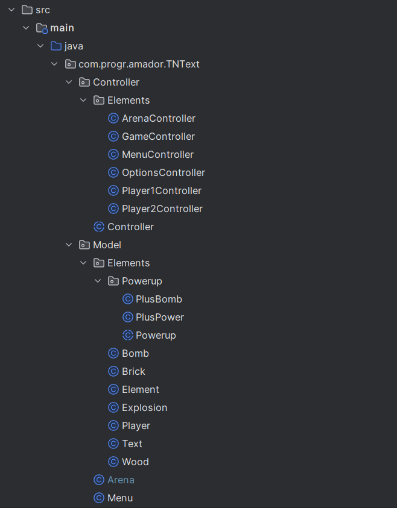
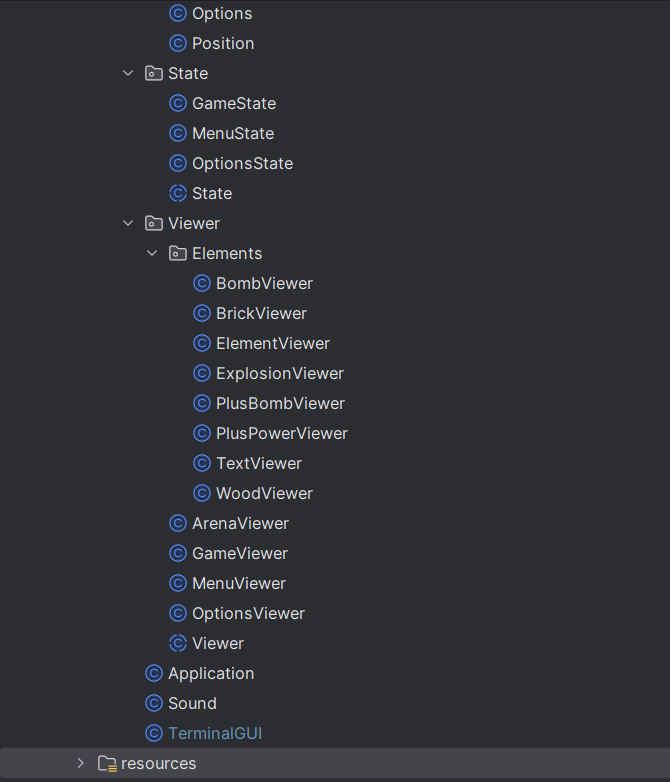
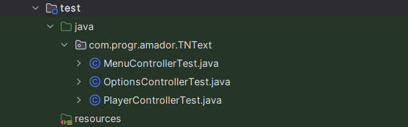
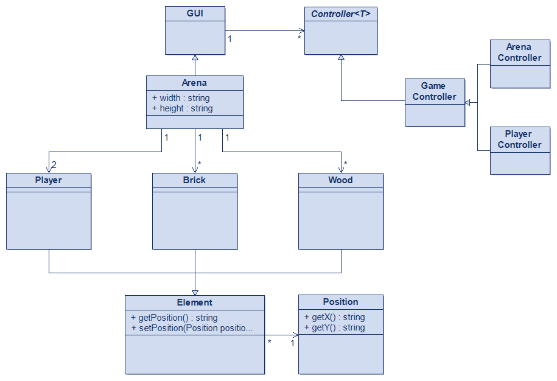

## LDTS_1204 - TNText 💣

  In this exciting two-player game, players must attempt to eliminate each other and be the last one standing by placing bombs and avoiding them.
  
  The players navigate through a grid-based maze where some walls are breakable and others are not. The breakable ones drop power-ups that can be collected by the players in order to upgrade their fighting capabilities.
  
  This project was developed by *Afonso Castro* (*up202208026*@fe.up.pt) , *Alexandre Ramos* (*up202208028*@fe.up.pt) and *Francisco Afonso* (*up202208115*@fe.up.pt) for LDTS 2023/24.

### IMPLEMENTED FEATURES

- **Movement** - The players can move around the maze.
- **Unique Maze** - Each time the game is loaded with a randomly generated maze.
- **Bombs** - The players will be able to place their bombs on the maze in order to open new ground, find power-ups or to eliminate their enemy.
- **Power-ups** - The two collectable power-ups (PlusBomb and PlusPower) allow a more challenging gameplay, as they respectively increase the number of bomb slots, and the power radius of their placed bombs.
- **Live Stats** - Visible counters updated in real-time for the players to know information about their active power-ups, like the number of available bombs.
- **Options Menu** - The players are able to turn on/off the spawn of each upgrade, and the background soundtrack.
- **Soundtrack** - Music that brings more life to the game.

### DESIGN

**Problem in Context**

The Arena class was violating the **Single Responsibility Principle** because it handled many features, such as the player movement.

**The Pattern**

To avoid this problem we started implementing part of the MVC Architectural Pattern, by already implementing the Controller and Model packages.

**Implementation**

The following images display the organization of our classes:

Some of the most important classes can be found in:

- [Application](src/main/java/com/progr/amador/TNText/Application.java)
- [Controller](src/main/java/com/progr/amador/TNText/Controller/Controller.java)
- [Viewer](src/main/java/com/progr/amador/TNText/Viewer/Viewer.java)
- [TerminalGUI](src/main/java/com/progr/amador/TNText/TerminalGUI.java)
- [State](src/main/java/com/progr/amador/TNText/State/State.java)
- [Menu](src/main/java/com/progr/amador/TNText/Model/Menu.java)
- [Options](src/main/java/com/progr/amador/TNText/Model/Options.java)
- [Arena](src/main/java/com/progr/amador/TNText/Model/Arena.java)
- [Position](src/main/java/com/progr/amador/TNText/Model/Position.java)
- [Element](src/main/java/com/progr/amador/TNText/Model/Elements/Element.java)
- [Player](src/main/java/com/progr/amador/TNText/Model/Elements/Player.java)
- [Bomb](src/main/java/com/progr/amador/TNText/Model/Elements/Bomb.java)

**Consequences**

The use of the State Pattern in the current design allows the following benefits:

- It allowed us to organize and catalog the user interface.
- It allowed us to clean our code and "tidy up the place".

### UML CLASS DIAGRAM

### SELF-EVALUATION

- Afonso Castro: 32%
- Alexandre Ramos: 34%
- Francisco Afonso: 34%