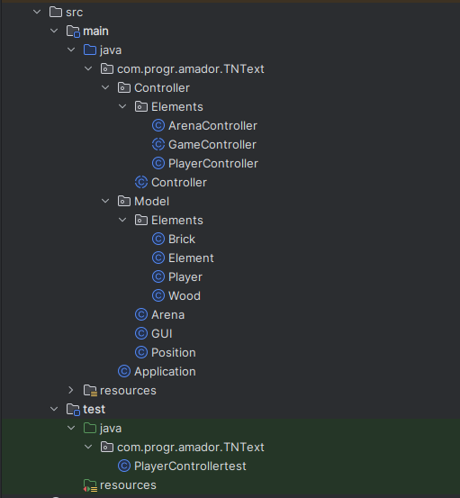

## LDTS_1204 - TNText 💣

  In this exciting game, players must attempt to eliminate each other and be the last one standing by placing bombs and avoiding them.
  
  The players navigate through a grid-based maze where some walls are breakable and others are not. The first ones can drop collectable and temporary power-ups that can increase the players number of bomb slots, enlarge the radius of their placed bombs and even a rare and game-changing twist that grants them increased life resilience.
  
  This project was developed by *Afonso Castro* (*up202208026*@fe.up.pt) , *Alexandre Ramos* (*up202208028*@fe.up.pt) and *Francisco Afonso* (*up202208115*@fe.up.pt) for LDTS 2023/24.

### IMPLEMENTED FEATURES

- **Movement** - The players can move around the maze.
- **Unique Maze** - Each time the game is loaded with a randomly generated maze.

### PLANNED FEATURES

- **Options Menu** - The players will be able to define some characteristics of the game, such as block frequency or turning on/off some upgrades.
- **Bombs** - The players will be able to place their bombs on the maze in order to open new ground, find collectables/power-ups or to eliminate their enemy.
- **Live Stats** - Information updated in real-time for the players to know their active upgrades, time since the beginning of the match, number of available bombs and remaining lifes.
- **Upgrades** - The players will be able to grab power-ups in order to upgrade bombs, or to gain an extra life. 
- **Movement Sprites** - The player sprite will adapt to the players movement direction.

### DESIGN

**Problem in Context**

The Arena class was violating the **Single Responsibility Principle** because it handled many features, such as the player movement.

**The Pattern**

To avoid this problem we started implementing part of the MVC Architectural Pattern, by already implementing the Controller and Model packages.

**Implementation**

The following image displays the new organization of our classes:

These classes can be found in the following files:

- [Arena](src/main/java/com/progr/amador/TNText/Model/Arena.java)
- [PlayerController](src/main/java/com/progr/amador/TNText/Controller/Elements/PlayerController.java)
- [ArenaController](src/main/java/com/progr/amador/TNText/Controller/Elements/ArenaController.java)

**Consequences**

The use of the State Pattern in the current design allows the following benefits:

- It allowed us to organize and catalog the user interface.
- It allowed us to clean our code and "tidy up the place".

### SELF-EVALUATION

- Afonso Castro: 32%
- Alexandre Ramos: 34%
- Francisco Afonso: 34%