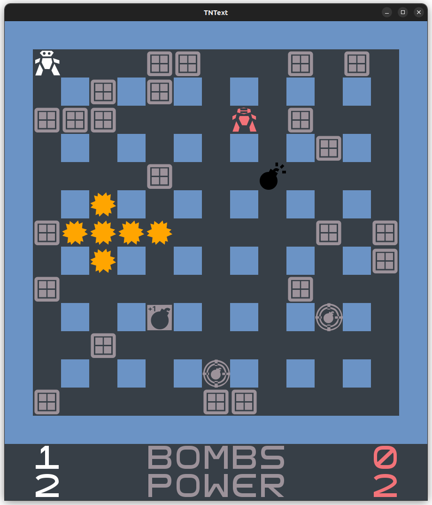
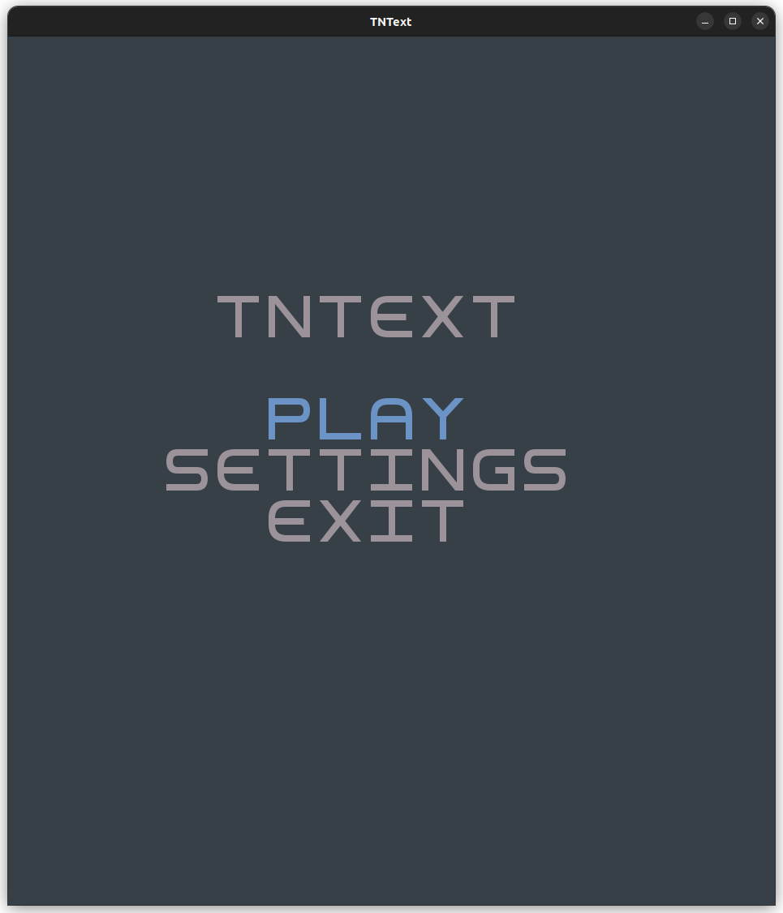
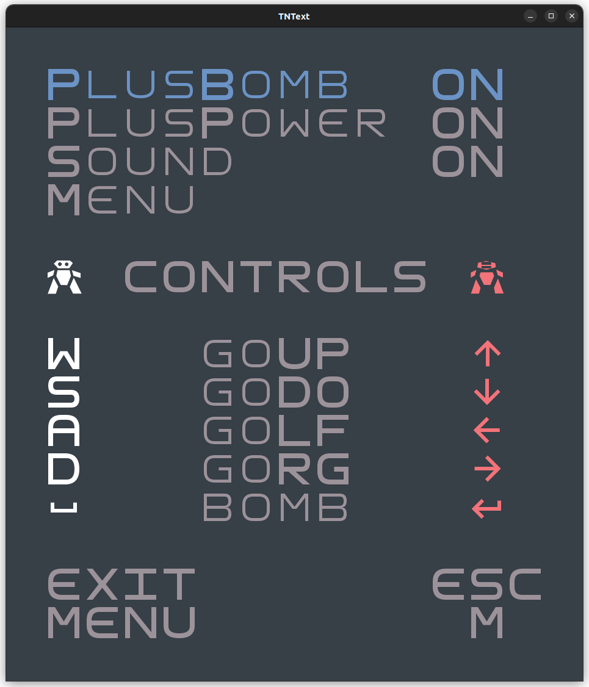

# TNText 💣

### DESCRIPTION
In this exciting two-player game, players must attempt to eliminate each other and be the last one standing by placing bombs and avoiding them.

The players navigate through a grid-based maze where some walls are breakable and others are not. The breakable ones drop power-ups that can be collected by the players in order to upgrade their fighting capabilities.

This project was developed for LDTS 2023/24 by:
- *Afonso Castro* (*up202208026*@fe.up.pt)
- *Alexandre Ramos* (*up202208028*@fe.up.pt)
- *Francisco Afonso* (*up202208115*@fe.up.pt)

For a more detailed version of this description click [here](./docs/README.md).

### INSTALLATION PROCESS

1. Download the latest .jar file from Releases
2. run $ java -jar TNText.jar

### SCREENSHOTS
|                  Arena                   |                Main Menu                 |                  Settings                   |
|:----------------------------------------:|:----------------------------------------:|:-------------------------------------------:|
|  |  |  |

