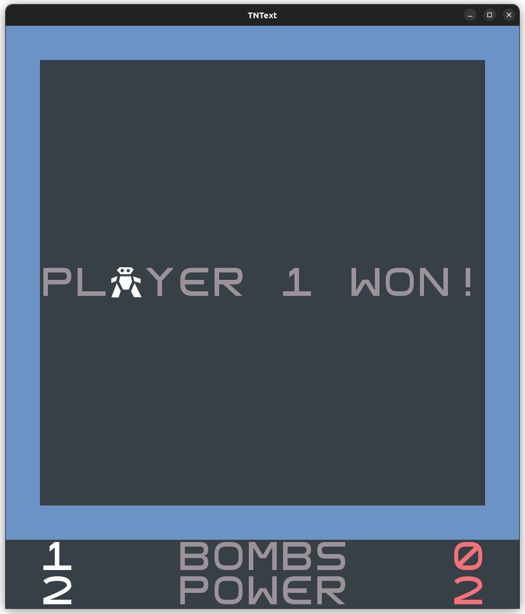
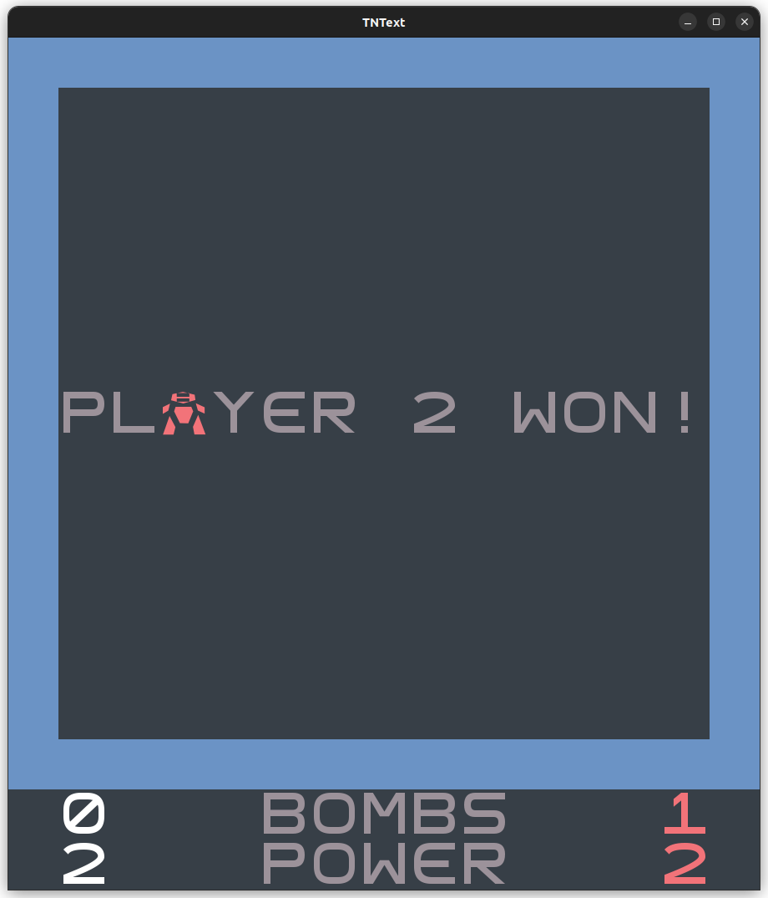
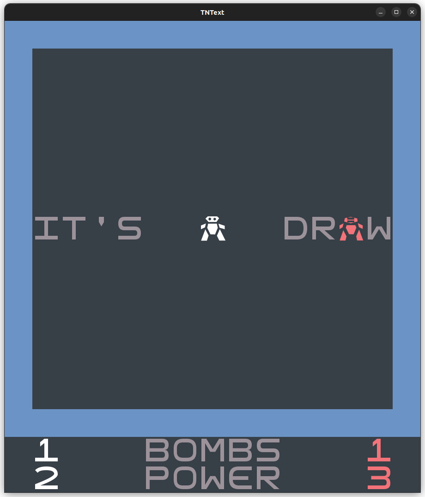

# LDTS_1204 - TNText 💣

### DESCRIPTION

In this exciting two-player game, players must attempt to eliminate each other and be the last one standing by placing bombs and avoiding them.

The players navigate through a grid-based maze where some walls are breakable and others are not. The breakable ones drop power-ups that can be collected by the players in order to upgrade their fighting capabilities.

This project was developed by *Afonso Castro* (*up202208026*@fe.up.pt) , *Alexandre Ramos* (*up202208028*@fe.up.pt) and *Francisco Afonso* (*up202208115*@fe.up.pt) for LDTS 2023/24.

For a more detailed version of this description click [here](./docs/README.md).

### SCREENSHOTS

#### Arena

#### Player 1 Victory Screen

#### Player 2 Victory Screen

#### Draw Screen

#### Main Menu

#### Settings Menu

