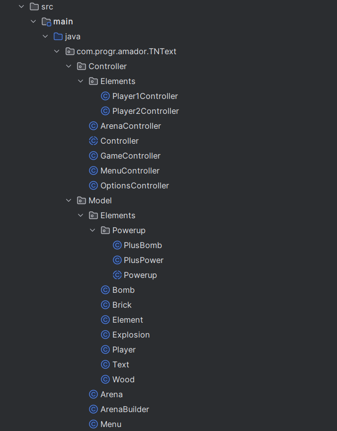
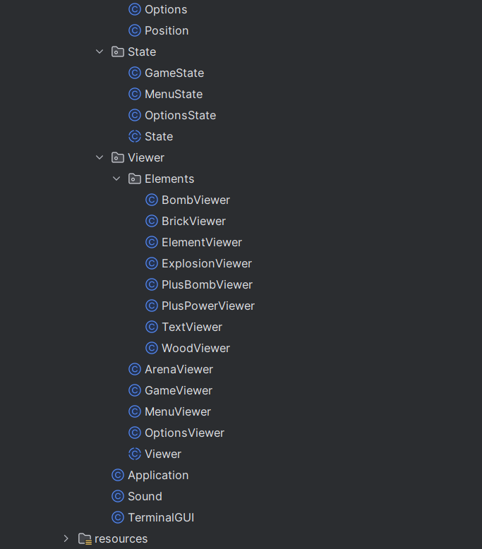
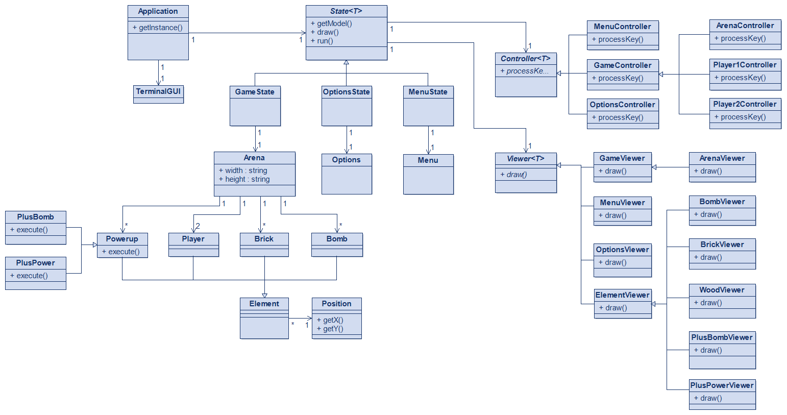
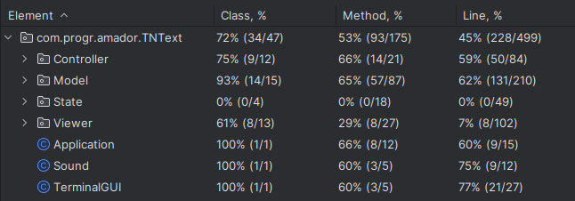

# LDTS_1204 - TNText 💣

  In this exciting two-player game, players must attempt to eliminate each other and be the last one standing by placing bombs and avoiding them.
  
  The players navigate through a grid-based maze where some walls are breakable and others are not. The breakable ones drop power-ups that can be collected by the players in order to upgrade their fighting capabilities.
  
  This project was developed by *Afonso Castro* (*up202208026*@fe.up.pt) , *Alexandre Ramos* (*up202208028*@fe.up.pt) and *Francisco Afonso* (*up202208115*@fe.up.pt) for LDTS 2023/24.

  For our game mockups check [here](../README.md)

## IMPLEMENTED FEATURES

- **Movement** - The players can move around the maze.
- **Unique Maze** - Each time the game is loaded with a randomly generated maze.
- **Bombs** - The players will be able to place their bombs on the maze in order to open new ground, find power-ups or to eliminate their enemy.
- **Power-ups** - The two collectable power-ups (PlusBomb and PlusPower) allow a more challenging gameplay, as they respectively increase the number of bomb slots, and the power radius of their placed bombs.
- **Live Stats** - Visible counters updated in real-time for the players to know information about their active power-ups, like the number of available bombs.
- **Options Menu** - The players are able to turn on/off the spawn of each upgrade, and the background soundtrack.
- **Soundtrack** - Music that brings more life to the game.

## DESIGN

### MVC Architectural Pattern and State Pattern

#### Problem in Context

The first problem we faced was how to structure the application as a whole. We needed to choose an architectural pattern that would allow us to avoid structural problems later on.

#### The Pattern

We decided to follow the MVC Architectural Pattern in combination with the State Pattern since it was the approach chosen by the teachers in the provided hero-solid repository, given that it is a pattern that divides the tasks of the program into 3 important components (Model,View,Controller), where each one handles specific development aspects of the application.

#### Consequences

The use of these two patterns in the current design allows the following benefits:
- Better organization of our Elements, user inputs and draw functions.
- Made transitions between states more easy and modifiable.
- Gave us a good structure for the addition of new classes and features.

### Strategy Pattern

#### Problem in Context

We wanted the classes to interact with the powerups in a way that it doesn't affect what type of powerup was being handled.

#### The Pattern

We chose to implement the Strategy Pattern, where we defined the family of powerups and made them interchangeable in the eyes of the algorithm, allowing it to vary seamlessly.

#### Consequences

- We can add new powerups without needing to restructure our code.
- No need for conditional statements.

### Singleton

#### Problem in Context

For our Application class we needed to ensure it only had one instance and that it provided a global point to access it.

#### The Pattern

We decided to implement the Singleton, as it allowed us to fulfill the requirements, and make sure that only one instance of the Application class exists.

#### Consequences

The use of this pattern is usefull in situations where exactly one object is needed to coordinate actions across the code.
The fact that it provides a global point of access to the instance, it allows the objects to easily interact with it.

### Game Loop Pattern 

#### Problem in Context

Given the fact that our game requires constant updates of the game state, frequent user input processing, constant game rendering, and time tracking, we had to find a way to make sure all of these requirements were efficiently implemented.

#### The Pattern

We implemented the Game Loop Pattern in the GameState, as it is the ideal solution for the problem given before.
This pattern decouples progression of game time from user input and processor speed, and it's used in almost every game engine out there.

#### Consequences

This pattern acts as a core mechanism that deals with the different components of the game, such as input processing, updating game state, and handling events.
It helps in maintaining a constant frame rate for the game, which is a crucial aspect for creating a great gameplay experience.

### CLASS ORGANIZATION

The following images display the organization of our classes:

<!-- Top image -->

<!-- Text or content in between if needed -->

<!-- Bottom image -->

Some of the most important classes can be found in:

- [Application](../src/main/java/com/progr/amador/TNText/Application.java)
- [Controller](../src/main/java/com/progr/amador/TNText/Controller/Controller.java)
- [Viewer](../src/main/java/com/progr/amador/TNText/Viewer/Viewer.java)
- [TerminalGUI](../src/main/java/com/progr/amador/TNText/TerminalGUI.java)
- [State](../src/main/java/com/progr/amador/TNText/State/State.java)
- [Menu](../src/main/java/com/progr/amador/TNText/Model/Menu.java)
- [Options](../src/main/java/com/progr/amador/TNText/Model/Options.java)
- [Arena](../src/main/java/com/progr/amador/TNText/Model/Arena.java)
- [Position](../src/main/java/com/progr/amador/TNText/Model/Position.java)
- [Element](../src/main/java/com/progr/amador/TNText/Model/Elements/Element.java)
- [Player](../src/main/java/com/progr/amador/TNText/Model/Elements/Player.java)
- [Bomb](../src/main/java/com/progr/amador/TNText/Model/Elements/Bomb.java)

### UML CLASS DIAGRAM

### TESTING

#### Screenshot of coverage report

HTML version available [here](../htmlReport/index.html)

### SELF-EVALUATION

- Afonso Castro: 33.3%
- Alexandre Ramos: 33.3%
- Francisco Afonso: 33.3%